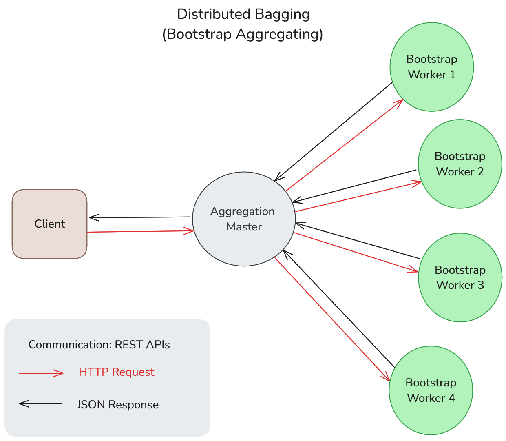
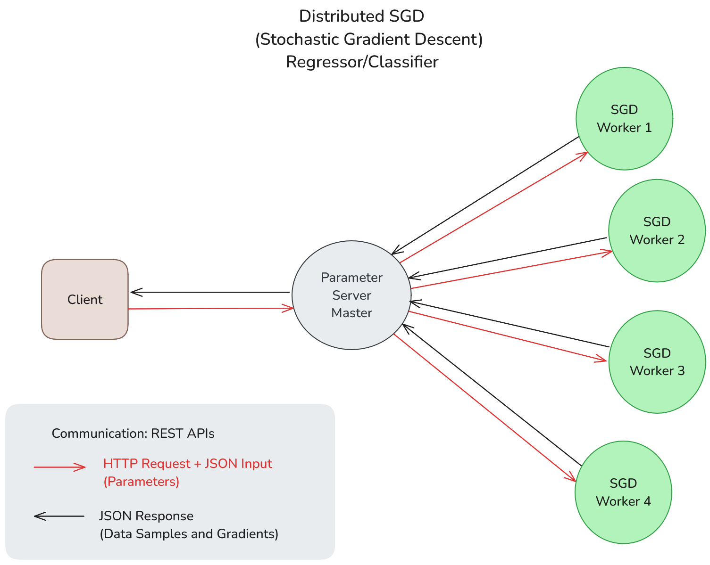

# Chimera
`chimera` is a Python package for distributed machine learning (DML).

## The Package

`chimera` supports the following types of DML:

- Data Parallelism: data distributed between the workers. Each worker has a copy of the model. This case includes Distributed SGD (Stochastic Gradient Descent) for models like linear regression, logistic regression and others, depending on the loss function.

- Model Parallelism: model distributed between the workers. Each worker has a copy of the dataset. This case includes Distributed SGD (Stochastic Gradient Descent) for generic neural network architectures.

- Hybrid Parallelism: data and model distributed between the workers. This case includes Distributed Bagging (Bootstrap Aggregating) with generic weak learners from the `scikit-learn` package.

Docker containers act as Workers. To run the created distributed system, it will be given a standardized interface named `Chimera`, on which a Master type and a port must be selected for the server in the host machine.

The client-master and master-workers communications are made via REST APIs.

## Running as a Package

[IN PROGRESS]

## Running the Source Code

1. Install Poetry following the documentation: https://python-poetry.org/docs/#installing-with-the-official-installer

2. Clone the `chimera` project via either HTTPS or SSH:
   - HTTPS: `git clone https://github.com/Samirnunes/chimera.git`
   - SSH: `git clone git@github.com:Samirnunes/chimera.git`

3. Go to project's root directory (where `pyproject.toml` is located) and run `poetry install`. It will generate a `.venv` file in the root directory with the installed dependencies, and a `poetry.lock` file.

4. Start the Docker Daemon. You can make it either by opening Docker Desktop or by starting the Daemon via CLI (in Linux: `sudo systemctl start docker`). Docker Daemon makes Docker REST APIs available, so we can run commands like `docker build` and `docker run`, that are called internally by `chimera`.

5. Run the examples to see `chimera` working!

## Examples

### Distributed Bagging (Bootstrap Aggregating)

In distributed bagging, the steps are:

1. Client makes a request to Aggregation Master, which redirects it to each Worker.

2. Each Bootstrap Worker receives the request for an action:

    - fit: trains the local weak learner using the local dataset. Before fit, Worker bootstraps (samples with reposition) the local dataset. Then, it uses the collected samples to fit the local model. When the process is finished, Master sends an "ok" to the Client.

    - predict: makes inference on new data by calculating, in the Master, the mean of the predictions of each Worker's local model's predictions.

    

### Distributed SGD (Stochastic Gradient Descent)

In distributed SGD, the summarized steps are:

1. Client makes a request to Parameter Server Master, which redirects it to Workers.

2. Each SGD Worker receives the request for an action:

    - fit: trains the distributed model. Worker has a copy of the model on its memory. Then, for a predefined number of iterations or until convergence:
        - 1. Worker calculates the gradient considering only its local dataset;
        - 2. Worker communicates through message passing its gradient to Master, which aggregates the gradients by calculating the mean, updates the model's weights and passes these weights to each Worker through message passing, so they update their local models.

    When convergence is reached, Master sends an ending message to Workers, then stops the message passing and stores the final model. Finally, it communicates an "ok" to Client.

    - predict: makes inference on new data using the final model available in Master.

    

