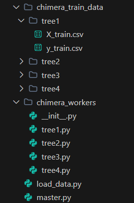
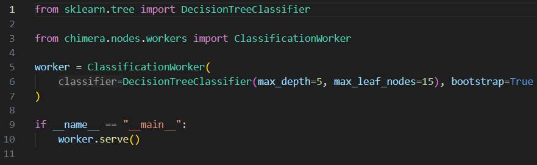
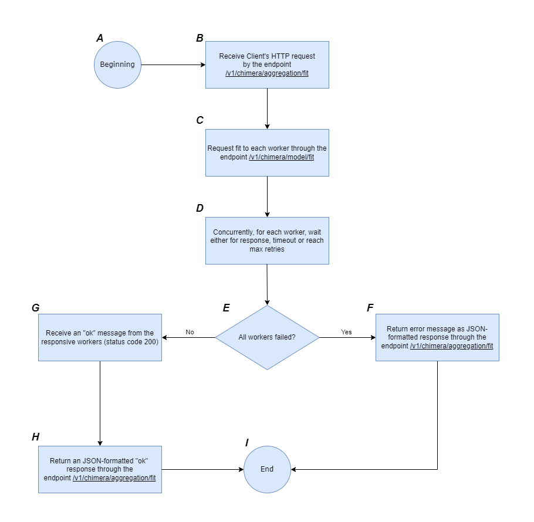
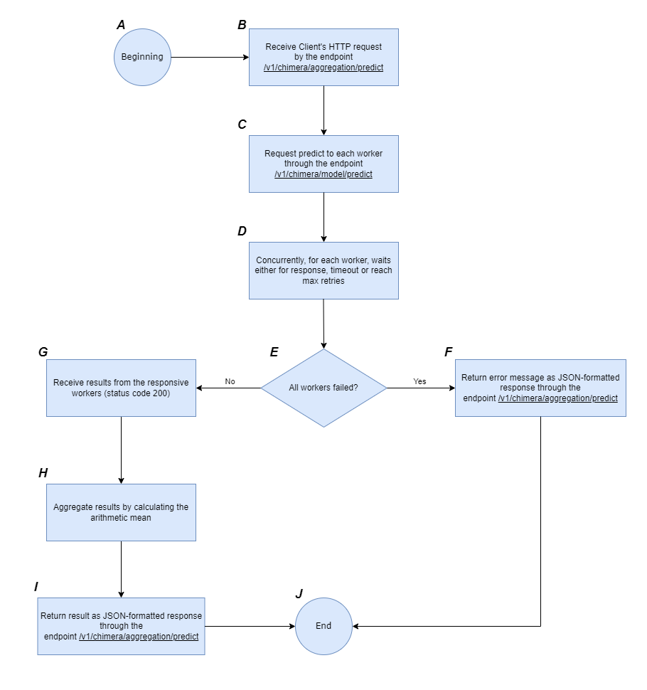

# Chimera: A Framework for Education and Prototyping in Distributed Machine Learning

    

## Introduction

`chimera` is a Python package for distributed machine learning (DML) designed for both educational and prototyping purposes. It provides a structured environment to experiment with key DML techniques, including Data Parallelism, Model Parallelism, and Hybrid Parallelism.

As a distributed computing framework, `chimera` aims to simplify the creation, in a local environment, of distributed machine learning models by streamlining the creation of a master node on the host machine and worker nodes on separate virtual machines using Docker containers. By providing a standardized API-based communication framework, `chimera` enables researchers and practitioners to test, evaluate, and optimize distributed learning algorithms with minimal configuration effort.

`chimera` supports the following types of DML techniques:

- Data Parallelism: data distributed between the workers. Each worker has a copy of the model. This case includes Distributed SGD (Stochastic Gradient Descent) for models like linear regression, logistic regression and others, depending on the loss function.

- Model Parallelism: model distributed between the workers. Each worker has a copy of the dataset. This case includes Distributed SGD (Stochastic Gradient Descent) for generic neural network architectures.

- Hybrid Parallelism: data and model distributed between the workers. This case includes Distributed Bagging (Bootstrap Aggregating) with generic weak learners from the `scikit-learn` package.

Docker containers act as Workers. To run the created distributed system, it will be given a standardized function named `run`, on which a Master type and a port must be selected for the server in the host machine.

The client-master and master-workers communications are made via REST APIs.

## Running as a Pypi Package

1. Install Poetry following the documentation: https://python-poetry.org/docs/#installing-with-the-official-installer

2. Initialize a virtual environment running the command `poetry init`

3. Install the latest version of `chimera` running the command `poetry add chimera-distributed-ml`

4. Start the Docker Daemon. You can make it either by opening Docker Desktop or by starting the Daemon via CLI (in Linux: `sudo systemctl start docker`). Docker Daemon makes Docker REST APIs available, so we can run commands like `docker build` and `docker run`, that are called internally by `chimera`.

5. Create and run distributed models with `chimera`!

## Running the Source Code

1. Install Poetry following the documentation: https://python-poetry.org/docs/#installing-with-the-official-installer

2. Clone the `chimera` project via either HTTPS or SSH:
   - HTTPS: `git clone https://github.com/Samirnunes/chimera.git`
   - SSH: `git clone git@github.com:Samirnunes/chimera.git`

3. Go to project's root directory (where `pyproject.toml` is located) and run `poetry install`. It will generate a `.venv` file in the root directory with the installed dependencies, and a `poetry.lock` file.

4. Start the Docker Daemon. You can make it either by opening Docker Desktop or by starting the Daemon via CLI (in Linux: `sudo systemctl start docker`). Docker Daemon makes Docker REST APIs available, so we can run commands like `docker build` and `docker run`, that are called internally by `chimera`.

5. Create and run distributed models with `chimera`!

## Creating and Running a Distributed Model with `chimera`

    

<strong>Figure:</strong> Example of `Chimera` files. 

1. After installing `chimera`, you need to create a `Master` and its `Workers`:
     - Master: create a `.py` file in your root directory. This file must specify the environment variables necessary to run the code in string format (in the case of Lists, you must follow the JSON string format for Lists) and run a `chimera` master server with `chimera.run`. For example: `chimera.run(AggregationMaster(), 8080)`. The available configuration environment variables are in the classes `NetworkConfig` and `WorkersConfig`, inside `src/chimera/containers/config.py`.

    

        
    

    
<strong>Figure:</strong> Example of a master's file. 

     - Workers: create a folder called `chimera_workers` and create `.py` files which are going to represent your workers. Each file must initialize a `chimera` worker and call `worker.serve()` inside an `if __name__ == "__main__":` block, which will initialize the worker server when `chimera.run` is called in the master's file. Note that the environment variable `CHIMERA_WORKERS_NODES_NAMES` in the master's file must contain all the workers' file names, without the `.py` suffix.

    

        
    

    
<strong>Figure:</strong> Example of a worker's file. 

2. Before running the master's file, you must specify the local training dataset for each worker. This is made by creating a folder called `chimera_train_data` containing folders with the same name as the worker's files (clearly without the `.py`). Each folder must have a `X_train.csv` file containing the features and a `y_train.csv` containing the labels. Whether `X_train.csv` and `y_train.csv` are the same or not for all the workers is up to you. Keep in mind what algorithm you want to create in the distributed environment!

3. Finally, you can run the master's file using: `poetry run python {your_master_filename.py}`. This should initialize all the worker's containers in your Docker environment and the master server in the host machine (the machine running the code).

    

<strong>Figure:</strong> Diagram of Client interactions with a `chimera` Distributed System. It summarizes how to create a distributed model with `chimera`. 

## Environment Variables

The following environment variables allow users to configure the `chimera` distributed machine learning system. These variables define network settings, worker configurations, and resource allocations, ensuring flexibility to different environments.

### Network Configuration

The following variables define the Docker network settings for `chimera`:

- `CHIMERA_NETWORK_NAME` (default: `"chimera-network"`)
        - The name of the Docker network where `chimera` runs.

- `CHIMERA_NETWORK_PREFIX` (default: `"192.168.10"`)
        - The IP network prefix for the Docker network.
        - Must be a valid IPv4 network prefix (e.g., `"192.168.10"`).

- `CHIMERA_NETWORK_SUBNET_MASK` (default: `24`)
        - The subnet mask for the Docker network, defining how many bits are reserved for the network.
        - Must be an integer between `0` and `32`.

### Workers Configuration

The following variables control the behavior of worker nodes in `chimera`:

- `CHIMERA_WORKERS_NODES_NAMES`
    - A list of worker node names.
    - Must be unique across all workers.
    - Example: `["worker1", "worker2", "worker3"]`.

- `CHIMERA_WORKERS_CPU_SHARES` (default: `[2]`)
    - A list of CPU shares assigned to each worker.
    - Each value must be an integer ≥ `2`.
    - Example: `[2, 4, 4]` assigns different CPU shares to three workers.

- `CHIMERA_WORKERS_MAPPED_PORTS` (default: `[101]`)
    - A list of host ports mapped to each worker’s container.
    - Must be unique across all workers.
    - Example: `[5001, 5002, 5003]` assigns distinct ports to three workers.

- `CHIMERA_WORKERS_HOST` (default: `"0.0.0.0"`)
    - The host IP address that binds worker ports.
    - `"0.0.0.0"` allows connections from any IP address.

- `CHIMERA_WORKERS_PORT` (default: `80`)
    - The internal container port that workers listen on.
    - This is the port inside the worker's container, not the exposed host port.

- `CHIMERA_WORKERS_ENDPOINTS_MAX_RETRIES` (default: `0`)
    - The maximum number of retry attempts when communicating with worker nodes.

- `CHIMERA_WORKERS_ENDPOINTS_TIMEOUT` (default: `100.0`)
    - The timeout (in seconds) for worker API endpoints.

These environment variables give users full control over how `chimera` distributes models, manages worker nodes, and configures networking in a flexible and simple manner.

## Examples

For more examples, see: https://github.com/Samirnunes/chimera-examples

### Hybrid Parallelism: Distributed Bagging (Bootstrap Aggregating)

In distributed bagging, the summarized steps are:

1. Client makes a request to Aggregation Master, which redirects it to Bootstrap Workers, which contain weak learners from the `scikit-learn` package.

2. Each Bootstrap Worker receives the request for an action:

    - fit: trains the local weak learner using the local dataset. Before fit, Worker bootstraps (samples with reposition) the local dataset. Then, it uses the collected samples to fit the local model. When the process is finished, Master sends an "ok" to the Client.

    - predict: makes inference on new data by calculating, in the Master, the mean of the predictions of each Worker's local model's predictions.

The following state machine flowchart depicts the steps in the fit action for the Aggregation Master:

    

<strong>Figure:</strong> State machine flowchart of Aggregation Master's /v1/chimera/aggregation/fit endpoint. 

The fit process begin at step A, where anything happened yet. When the Client requests the fit action to the endpoint /v1/chimera/aggregation/fit, in step B, the Master receives the request and broadcasts it to all the workers, through the endpoint /v1/chimera/model/fit, in the step C.

Then, concurrently, the Master wait either for a response, timeout or maximum retries by each worker, which is represented by the block D. If the worker suffered timeout or reached the maximum number of retries, it is considered failed. In the conditional block E, if at least one of the workers hasn't failed, the flow goes to the block G, where the Master will receive an "ok" message labeled with status code 200 from the responsive workers, indicating that all the responsive workers now have a model fitted in their local training data. Finally, in the block H, the Master returns a JSON-formatted response through the endpoint /v1/chimera/aggregation/fit to the Client, containing an "ok" message, indicating that the distributed model is now fitted; the flow then ends in the block I.

If all the workers failed in the block E, the flow goes to F, where the Master returns an JSON-formatted error message through the endpoint /v1/chimera/aggregation/fit to the Client, indicating the error. Finally, the flow ends in the block I.

The following state machine flowchart depicts the steps in the predict action for the Aggregation Master:

    

<strong>Figure:</strong> State machine flowchart of Aggregation Master's /v1/chimera/aggregation/predict endpoint. 

The predict process begin at step A, where anything happened yet. When the Client requests the predict action to the endpoint /v1/chimera/aggregation/predict, in step B, the Master receives the request and broadcasts it to all the workers, through the endpoint /v1/chimera/model/predict, in the step C.

Then, concurrently, the Master wait either for a response, timeout or maximum retries by each worker, which is represented by the block D. If the worker suffered timeout or reached the maximum number of retries, it is considered failed. In the conditional block E, if at least one of the workers hasn't failed, the flow goes to the block G, where the Master will receive the results from the responsive workers, with status code 200, containing the predictions from each local model. In the block H, the Master aggregates the results by calculating the arithmetic mean, and, in the block I, it returns a JSON-formatted response through the endpoint /v1/chimera/aggregation/predict to the Client, containing the final predictions; the flow then ends in the block J.

If all the workers failed in the block E, the flow goes to F, where the Master returns an JSON-formatted error message through the endpoint /v1/chimera/aggregation/predict to the Client, indicating the error. Finally, the flow ends in the block J.

### Data Parallelism: Distributed SGD (Stochastic Gradient Descent)

In distributed SGD, the summarized steps are:

1. Client makes a request to Parameter Server Master, which redirects it to SGD Workers.

2. Each SGD Worker receives the request for an action:

    - fit: trains the distributed model. Worker has a copy of the model on its memory. Then, for a predefined number of iterations or until convergence:
        - 1. Worker calculates the gradient considering only its local dataset;
        - 2. Worker communicates through REST API its gradient to Master, which aggregates the gradients by calculating the mean, updates the model's parameters and passes these parameters back to each Worker through REST API, so they update their local models.

    When convergence is reached, Master stops sending the parameters to Workers and stores the final model. Finally, it communicates an "ok" to Client.

    - predict: makes inference on new data using the final model available in the Master.

The following state machine flowchart depicts the steps in the fit action for the Parameter Server Master:

    

<strong>Figure:</strong> State machine flowchart of Parameter Server Master's /v1/chimera/parameter-server/fit endpoint. 

The fit process begin at step A, where anything happened yet. When the Client requests the fit action to the endpoint /v1/chimera/parameter-server/fit, in step B, the Master receives the request. Then, it makes an initial fit in its model through sample data collected from workers, represented by the block C. The sample data is requested to any of the workers through the endpoint /v1/chimera/sgd/request-data-sample. For this request, the Master asks sequentially to the workers, then the first one to return an status code 200 response is the one which will give the sample data to the Master. The sample data consists in some rows of the worker's local training data, so in regression the Master knows the columns of the data and in the case of classification the Master knows both columns and all the classes that the training data has. After the initial fit, the Master broadcasts a fit step to each worker through the endpoint /v1/chimera/sgd/fit-step and sends to each one its coeficients and intercept, which occurs in the step D. After that, concurrently, for each worker, the Master waits either for response, timeout or maximum retries. If all the workers failed in the condition F - that is - if all the workers suffered timeout or reached maximum retries - the flow goes to G and returns an error message through the endpoint /v1/chimera/sgd/fit, containing the error. Finally, the flow ends in the block M.

If at least one worker responded, the Master receive its results, which consists in the gradients for the coeficients and for the intercept. In the block I, the Master aggregate these gradients by calculating the arithmetic mean for both coeficients and intercept. Hen, in J, the condition of convergence and maximum iterations are verified. If the one of them is true, the flow goes to L and returns an "ok" JSON-formatted response through the endpoint /v1/chimera/sgd/fit, and finishes in the block M. However, if the model not converged or it hasn't reached the maximum iterations set by the user, the flows goes to K, where the Master updates it's model's coeficients and intercepts with the SGD formula. The loops continues in the block D until the conditions F or J are met.

The following state machine flowchart depicts the steps in the predict action for the Parameter Server Master:

    

<strong>Figure:</strong> State machine flowchart of Parameter Server Master's /v1/chimera/parameter-server/predict endpoint. 

The predict process begin at step A, where anything happened yet. When the Client requests the predict action to the endpoint /v1/chimera/parameter-server/predict, in step B, the Master receives the request. Then, in step C, if the model in the Master is fitted - that is, if the endpoint /v1/chimera/parameter-server/fit has been called before and returned a status code 200 - the model returns the predictions as a JSON-formatted response to the Client through the endpoint /v1/chimera/parameter-server/predict. Finally, the flow ends in the block F.

In the block C, if the model hasn't been fitted, an error message is returned to the Client through the endpoint /v1/chimera/parameter-server/predict. Then, the flow ends in the block F as before.

## References

### Papers

- "A Survey on Distributed Machine Learning": https://dl.acm.org/doi/pdf/10.1145/3377454

- "Distributed Machine Learning": https://dl.acm.org/doi/fullHtml/10.1145/3631461.3632516

### Websites

- https://studytrails.com/2021/02/10/distributed-machine-learning-2-architecture/

- https://www.almabetter.com/bytes/tutorials/mlops/distributed-computing-for-ml

- https://neptune.ai/blog/distributed-training

- https://learn.microsoft.com/en-us/azure/machine-learning/concept-distributed-training?view=azureml-api-2
