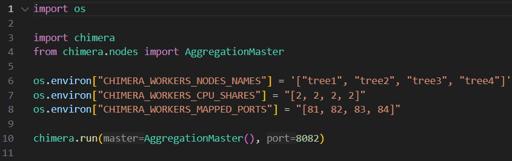
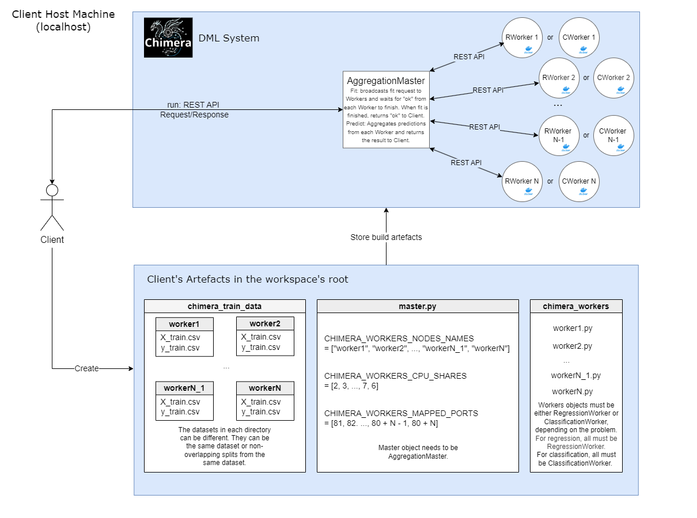
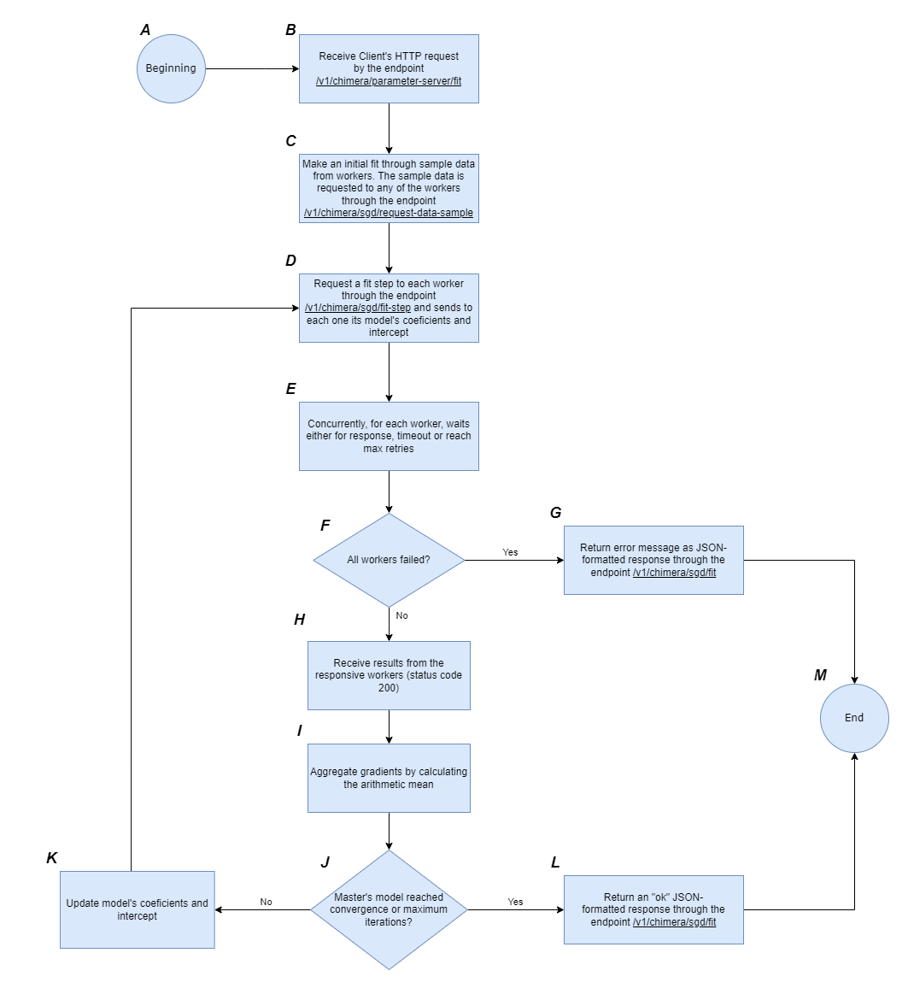

# Chimera: A Framework for Education and Prototyping in Distributed Machine Learning

    

## Paper [WIP]

https://www.overleaf.com/read/hwwmfvgdqnny#01433e

## Running as a Pypi Package

1. Install Poetry following the documentation: https://python-poetry.org/docs/#installing-with-the-official-installer

2. Initialize a virtual environment running the command `poetry init`

3. Install the latest version of `chimera` running the command `poetry add chimera-distributed-ml`

4. Start the Docker Daemon. You can make it either by opening Docker Desktop or by starting the Daemon via CLI (in Linux: `sudo systemctl start docker`). Docker Daemon makes Docker REST APIs available, so we can run commands like `docker build` and `docker run`, that are called internally by `chimera`.

5. Create and run distributed models with `chimera`!

## Running the Source Code

1. Install Poetry following the documentation: https://python-poetry.org/docs/#installing-with-the-official-installer

2. Clone the `chimera` project via either HTTPS or SSH:
   - HTTPS: `git clone https://github.com/Samirnunes/chimera.git`
   - SSH: `git clone git@github.com:Samirnunes/chimera.git`

3. Go to project's root directory (where `pyproject.toml` is located) and run `poetry install`. It will generate a `.venv` file in the root directory with the installed dependencies, and a `poetry.lock` file.

4. Start the Docker Daemon. You can make it either by opening Docker Desktop or by starting the Daemon via CLI (in Linux: `sudo systemctl start docker`). Docker Daemon makes Docker REST APIs available, so we can run commands like `docker build` and `docker run`, that are called internally by `chimera`.

5. Create and run distributed models with `chimera`!

## Introduction

### Contextualization

Machine Learning (ML) is a category of artificial intelligence that enables computers to think and learn on their own. Generically, it is about making computers modify their actions in order to improve these actions to attain more accuracy, where accuracy is measured in terms of the number of times the chosen actions results into correct ones. ML was first defined by Arthur Samuel: “a field of study that provides learning capability to computers without being explicitly programmed”.

ML is a multi-disciplinary field having a wide-range of research domains reinforcing its existence. It can be applied to various areas of computing to design and program explicit algorithms with high performance output. For example, ML can be applied in email spam filtering, fraud detection on social network, online stock trading, face & shape detection, medical diagnosis, traffic prediction, character recognition and product recommendation.

As ML tasks grow in scale and complexity, they present increasing challenges. While larger datasets and models can lead to more accurate results, they also demand significantly more computational power. Relying solely on centralized computing becomes inefficient and often unfeasible due to limitations in scalability, speed, and resource availability—especially when training models with large architectures.

To address this, Distributed Machine Learning (DML) has emerged as a powerful approach. It leverages distributed computing, which utilizes multiple interconnected resources across a network. These resources collaborate through a communication infrastructure that enables shared task execution. By combining the principles of ML and distributed systems, DML allows for more efficient processing of large-scale data and complex model architectures. Rather than depending on a single machine, training is distributed across several devices—such as servers, nodes, or edge devices—thus overcoming the bottlenecks of centralized approaches and making it possible to tackle more demanding ML problems.

Fundamentally, DML takes advantage of parallelism. This parallelized strategy accelerates training, improves scalability, enhances fault tolerance, and optimizes resource use. There are two main strategies for distributing work among machines: Data Parallelism and Model Parallelism. In some cases, a combination of both — known as Hybrid Parallelism — is employed.

With Data Parallelism, each worker node trains the same model on a different portion of the dataset. In contrast, Model Parallelism involves splitting the model itself across different nodes, with each one handling a specific part of the model while using the complete dataset. Hybrid parallelism blends both approaches, distributing parts of the model and data simultaneously to balance computational loads and improve training efficiency.

Executing ML algorithms in a distributed setting initially requires transforming single-threaded algorithms into parallel ones. This transformation can be quite challenging, as it depends heavily on the specific algorithm and demands a deep understanding of how it works. The next phase is implementing these parallel versions, which requires knowledge of the system's runtime behavior and semantics to ensure both correctness and efficiency.

### Motivation

The rapid rise in AI demand, driven by advancements in ML and hardware acceleration, has led to a need for large amounts of training data. As data requirements grow faster than computing power, distributing ML workloads across multiple machines becomes essential to move beyond the limitations of centralized systems. Thus, studying DML is essential in today’s data-driven world. Understanding DML not only equips researchers and engineers with the tools to build more powerful AI systems but also helps in overcoming the computational bottlenecks that limit innovation.

Faced by the abundant use of ML in industry and academia, the effective teaching of core concepts in this field becomes very important, as said by Steinbach et al. Marques et al. explains that few understand the technology behind ML and emphasizes the new challenges to extend computing education early to ML concepts helping students to understand its potential and limits.

In the other hand, the work by Correia et al. highlights the need for new methodologies in teaching distributed systems, emphasizing the importance of hands-on, active learning. By using the Hadoop framework, students directly engage with real-world data architectures and infrastructures, helping to reduce the abstraction barriers that often make these systems difficult to understand. This approach underscores the necessity for teaching techniques that make complex distributed systems more accessible and relatable to students. Such methodologies are essential in bridging the gap between theoretical concepts and practical implementation, providing a more effective learning experience in the context of distributed systems.

Considering the context of both ML and distributed systems, there is a gap in DML lecturing that the present work aims to fill, which is related to the inexistence of educational frameworks in the field of DML specifically designed for undergrad students. Some distributed frameworks present educational materials, like Ray. However, these frameworks aren’t developed to depicts the internal working of its systems in a simple way. Besides, they often need many configurations to prototype a system, as shown in Pytorch’s tutorial.

Similarly, other frameworks like MLbase and Apache Mahout provide powerful tools for DML. However, they are primarily designed for researchers and practitioners who are already familiar with the complexities of distributed systems. These frameworks, though highly scalable and feature-rich, do not focus on simplifying the internal workings of DML systems for educational purposes. They require significant expertise to configure and implement, making them less suitable for undergrad students who are just beginning to explore DML.

Finally, as Galakatos et al. state, transposing a machine learning algorithm into its distributed form is challenging and requires deep knowledge in ML and distributed systems. Therefore, a framework that supports both learning about DML and rapid prototyping is really essential.

### Objective

The objective of this work is to develop chimera, a Python package for DML aimed at educational and prototyping use cases. The project seeks to provide a structured and user-friendly framework for implementing key DML techniques, including Data Parallelism, Model Parallelism, and Hybrid Parallelism. By leveraging Docker containers to simulate distributed environments locally, chimera will streamline the setup of Master and Worker nodes, offering an API-based communication system that simplifies the testing, evaluation, and optimization of distributed learning algorithms.

Also, experiments will be conducted to show that the package properly works and to integrate the knowledge of DML into ITA’s Computer Engineering’s Distributed Computing course. Some of the specific topics which will be explored are:

- Parallelism in distributed systems;
- Performance of distributed systems: latency measurement across Master and Workers;
- Logging: production of logs to monitor the system’s state;
- Helper Tools: Docker, FastAPI, Uvicorn and scikit-learn.

Finally, it will be conducted an educational practice with undergraduate students using the developed framework. After the practice, feedbacks will be collected and analysed, so future steps can be designed.

## Overview

The `chimera` framework is a Python package for DML designed for educational and prototyping purposes. It provides a structured environment for experiments with key DML techniques, including Data Parallelism, Model Parallelism, and Hybrid Parallelism.

As a distributed computing framework, `chimera` aims to simplify the creation, in a local environment, of distributed machine learning models by streamlining the construction of a Master node on the host machine and Worker nodes on separate virtual machines using Docker containers. By providing a standardized API-based communication framework, `chimera` enables researchers and practitioners to test, evaluate, and optimize distributed learning algorithms with minimal configuration effort. The framework supports Data, Model and Hybrid Parallelism, whose algorithms are shown below:

- Data Parallelism: Distributed SGD for models such as linear regression, logistic regression, and others, depending on the loss function.

- Model Parallelism: Distributed Bagging using generic weak learners from the scikit-learn package, with the same dataset on each Worker node.

Hybrid Parallelism: Distributed Bagging using generic weak learners from the scikit-learn package, with different datasets on each Worker node.

Docker containers act as Workers. To run the created distributed system, it will be given a standardized function named `run`, on which a Master type and a port must be selected for the server in the host machine. The `run` function starts the Chimera master server and handles worker containers, then initializing the necessary components for the distributed system to work.

The client-master and master-workers communications are made via REST APIs.

## Creating and Running a Distributed Model with `chimera`

    

<strong>Figure:</strong> Example of Chimera files. 

1. After installing `chimera`, you need to create a `Master` and its `Workers`:
     - Master: create a `.py` file in your root directory. This file must specify the environment variables necessary to run the code in string format (in the case of Lists, you must follow the JSON string format for Lists) and run a `chimera` master server with `chimera.run`. For example: `chimera.run(AggregationMaster(), 8080)`. The available configuration environment variables are in the classes `NetworkConfig` and `WorkersConfig`, inside `src/chimera/containers/config.py`.

    

        
    

    
<strong>Figure:</strong> Example of a master's file. 

     - Workers: create a folder called `chimera_workers` and create `.py` files which are going to represent your workers. Each file must initialize a `chimera` worker and call `worker.serve()` inside an `if __name__ == "__main__":` block, which will initialize the worker server when `chimera.run` is called in the master's file. Note that the environment variable `CHIMERA_WORKERS_NODES_NAMES` in the master's file must contain all the workers' file names, without the `.py` suffix.

    

        
    

    
<strong>Figure:</strong> Example of a worker's file. 

2. Before running the master's file, you must specify the local training dataset for each worker. This is made by creating a folder called `chimera_train_data` containing folders with the same name as the worker's files (clearly without the `.py`). Each folder must have a `X_train.csv` file containing the features and a `y_train.csv` containing the labels. Whether `X_train.csv` and `y_train.csv` are the same or not for all the workers is up to you. Keep in mind what algorithm you want to create in the distributed environment!

3. Finally, you can run the master's file using: `poetry run python {your_master_filename.py}`. This should initialize all the worker's containers in your Docker environment and the master server in the host machine (the machine running the code).

    

<strong>Figure:</strong> General Architecture for a Chimera Distributed System. It summarizes how to create a distributed model with Chimera. 

## Environment Variables

The following environment variables allow users to configure the `chimera` distributed machine learning system. These variables define network settings, worker configurations, and resource allocations, ensuring flexibility to different environments.

### Network Configuration

The following variables define the Docker network settings for `chimera`:

- `CHIMERA_NETWORK_NAME` (default: `"chimera-network"`)
        - The name of the Docker network where `chimera` runs.

- `CHIMERA_NETWORK_PREFIX` (default: `"192.168.10"`)
        - The IP network prefix for the Docker network.
        - Must be a valid IPv4 network prefix (e.g., `"192.168.10"`).

- `CHIMERA_NETWORK_SUBNET_MASK` (default: `24`)
        - The subnet mask for the Docker network, defining how many bits are reserved for the network.
        - Must be an integer between `0` and `32`.

### Workers Configuration

The following variables control the behavior of worker nodes in `chimera`:

- `CHIMERA_WORKERS_NODES_NAMES`
    - A list of worker node names.
    - Must be unique across all workers.
    - Example: `["worker1", "worker2", "worker3"]`.

- `CHIMERA_WORKERS_CPU_SHARES` (default: `[2]`)
    - A list of CPU shares assigned to each worker.
    - Each value must be an integer ≥ `2`.
    - Example: `[2, 4, 4]` assigns different CPU shares to three workers.

- `CHIMERA_WORKERS_MAPPED_PORTS` (default: `[101]`)
    - A list of host ports mapped to each worker’s container.
    - Must be unique across all workers.
    - Example: `[5001, 5002, 5003]` assigns distinct ports to three workers.

- `CHIMERA_WORKERS_HOST` (default: `"0.0.0.0"`)
    - The host IP address that binds worker ports.
    - `"0.0.0.0"` allows connections from any IP address.

- `CHIMERA_WORKERS_PORT` (default: `80`)
    - The internal container port that workers listen on.
    - This is the port inside the worker's container, not the exposed host port.

- `CHIMERA_WORKERS_ENDPOINTS_MAX_RETRIES` (default: `0`)
    - The maximum number of retry attempts when communicating with worker nodes.

- `CHIMERA_WORKERS_ENDPOINTS_TIMEOUT` (default: `100.0`)
    - The timeout (in seconds) for worker API endpoints.

These environment variables give users full control over how `chimera` distributes models, manages worker nodes, and configures networking in a flexible and simple manner.

## Logging

The framework uses two dedicated loggers to track system's behavior and latency metrics:

- Status Logger (`chimera_status`):
  Logs general status messages related to the system's operations, such as workflow progress, key events, and high-level actions. The logs are saved in the file `chimera_status.log`.

- Time Logger (`chimera_time`):
  Logs latency metrics, then, it's useful for monitoring and debugging time efficiency. These logs are stored in the file `chimera_time.log`.

Both loggers are configured using Python’s built-in logging module, and log messages at the INFO level. Each logger writes to its respective log file through a `FileHandler`.

## Examples

For more examples, see: https://github.com/Samirnunes/chimera-examples

### Hybrid Parallelism: Distributed Bagging (Bootstrap Aggregating)

    

<strong>Figure:</strong> Architecture for a Chimera Distributed System in the context of Hybrid Parallelism. It summarizes how to create a distributed model with Chimera. 

In distributed bagging, the summarized steps are:

1. Client makes a request to Aggregation Master, which redirects it to Bootstrap Workers. Each worker contains a weak learner from the `scikit-learn` package.

2. Each Bootstrap Worker receives the request for an action:

    - fit: trains the local weak learner using the local dataset. Before fit, Worker bootstraps (samples with reposition) the local dataset. Then, it uses the collected samples to fit the local model. When the process is finished, Master sends an "ok" to the Client.

    - predict: makes inference on new data by calculating, in the Master, the mean of the predictions of each Worker's local model's predictions.

The following state machine flowchart depicts the steps in the fit action for the Aggregation Master:

    

<strong>Figure:</strong> State machine flowchart of Aggregation Master's /v1/chimera/aggregation/fit endpoint. 

The fitting process begins at step A, where nothing has happened yet. When the client sends a fit request to the endpoint `/v1/chimera/aggregation/fit`, at step B, the Master receives the request and broadcasts it to all workers via the endpoint `/v1/chimera/model/fit`, as shown in step C.

Then, concurrently, the Master waits for either a response, a timeout, or the maximum number of retries from each worker—this is represented by step D. If a worker times out or reaches the retry limit, it is considered failed. In the conditional step E, if at least one worker responds successfully, the flow proceeds to step G. There, the Master receives an "ok" message with status code 200 from the responsive workers, indicating that their local models have been successfully fitted using their training data. Finally, in step H, the Master sends a JSON-formatted response to the client via the endpoint `/v1/chimera/aggregation/fit`, containing an "ok" message to confirm that the distributed model is now fitted. The flow then ends at step I.

If all workers fail in step E, the flow moves to step F, where the Master returns a JSON-formatted error message to the client via the endpoint `/v1/chimera/aggregation/fit`, indicating the error. Finally, the flow ends at step I.

The following state machine flowchart depicts the steps in the predict action for the Aggregation Master:

    

<strong>Figure:</strong> State machine flowchart of Aggregation Master's /v1/chimera/aggregation/predict endpoint. 

The prediction process begins at step A, where nothing has happened yet. When the client sends a prediction request to the endpoint `/v1/chimera/aggregation/predict`, at step B, the Master receives the request and broadcasts it to all workers via the endpoint `/v1/chimera/model/predict`, as shown in step C.

Then, concurrently, the Master waits for either a response, a timeout, or the maximum number of retries from each worker—this is represented by step D. If a worker times out or reaches the retry limit, it is considered failed. In the conditional step E, if at least one worker has responded successfully, the flow proceeds to step G. There, the Master receives results from the responsive workers—status code 200 responses containing predictions from each local model. In step H, the Master aggregates these results by computing the arithmetic mean, and in step I, it returns a JSON-formatted response to the client via the endpoint `/v1/chimera/aggregation/predict`, containing the final predictions. The flow then ends at step J.

If all workers fail in step E, the flow goes to step F, where the Master returns a JSON-formatted error message to the client via the endpoint `/v1/chimera/aggregation/predict`, indicating the issue. Finally, the flow ends at step J.

### Data Parallelism: Distributed SGD (Stochastic Gradient Descent)

    

<strong>Figure:</strong> Architecture for a Chimera Distributed System in the context of Data Parallelism. It summarizes how to create a distributed model with Chimera. 

In distributed SGD, the summarized steps are:

1. Client makes a request to Parameter Server Master, which redirects it to SGD Workers.

2. Each SGD Worker receives the request for an action:

    - fit: trains the distributed model. Worker has a copy of the model on its memory. Then, for a predefined number of iterations or until convergence:
        - 1. Worker calculates the gradient considering only its local dataset;
        - 2. Worker communicates through REST API its gradient to Master, which aggregates the gradients by calculating the mean, updates the model's parameters and passes these parameters back to each Worker through REST API, so they update their local models.

    When convergence is reached, Master stops sending the parameters to Workers and stores the final model. Finally, it communicates an "ok" to Client.

    - predict: makes inference on new data using the final model available in the Master.

The following state machine flowchart depicts the steps in the fit action for the Parameter Server Master:

    

<strong>Figure:</strong> State machine flowchart of Parameter Server Master's /v1/chimera/parameter-server/fit endpoint. 

The fitting process begins at step A, where nothing has happened yet. When the client sends a fit request to the endpoint `/v1/chimera/parameter-server/fit`, at step B, the Master receives this request. It then performs an initial fit on its model using sample data collected from the workers, as represented in step C. This sample data is requested from any of the workers via the endpoint `/v1/chimera/sgd/request-data-sample`. The Master sends requests sequentially to the workers, and the first one to respond with a status code 200 provides the sample data. This data consists of a few rows from the worker's local training dataset. In regression, the Master learns the data columns; in classification, it also learns all the classes present in the dataset.

After the initial fit, the Master broadcasts a fit step to each worker via the endpoint `/v1/chimera/sgd/fit-step`, sending each one the current model's coefficients and intercept—this occurs in step D. From there, the Master concurrently waits for a response, a timeout, or the maximum number of retries from each worker. If all workers fail (step F)—that is, if every worker times out or exceeds the retry limit—the flow proceeds to step G and returns an error message through the endpoint `/v1/chimera/sgd/fit`. The process ends at step M.

If at least one worker responds, the Master receives results consisting of gradients for both the coefficients and the intercept. In step I, the Master aggregates these gradients by computing their arithmetic mean. Then, in step J, it checks for convergence or whether the maximum number of iterations has been reached. If either condition is met, the flow proceeds to step L, returns an "ok" JSON-formatted response via the endpoint `/v1/chimera/sgd/fit`, and concludes at step M. However, if the model has not converged and the maximum iterations have not been reached, the flow moves to step K, where the Master updates its model’s coefficients and intercept using the SGD formula. The loop continues from step D until either condition F or J is satisfied.

The following state machine flowchart depicts the steps in the predict action for the Parameter Server Master:

    

<strong>Figure:</strong> State machine flowchart of Parameter Server Master's /v1/chimera/parameter-server/predict endpoint. 

The prediction process begins at step A, where nothing has happened yet. When the client sends a prediction request to the endpoint `/v1/chimera/parameter-server/predict`, at step B, the Master receives the request. Then, in step C, if the model on the Master has been fitted—that is, if the endpoint `/v1/chimera/parameter-server/fit` was previously called and returned a status code 200—the Master returns the predictions to the client as a JSON-formatted response via the same prediction endpoint. Finally, the flow ends at step F.

If, in step C, the model has not been fitted, an error message is returned to the client through the endpoint `/v1/chimera/parameter-server/predict`. The flow then ends at step F, as before.

## References

### Papers

- VERBRAEKEN, Joost et al. A survey on distributed machine learning. Acm computing surveys (csur), v. 53, n. 2, p. 1-33, 2020. Disponível em: https://dl.acm.org/doi/pdf/10.1145/3377454

- Chatterjee, B. (2024). Distributed Machine Learning. In Proceedings of the 25th International Conference on Distributed Computing and Networking (ICDCN '24) (pp. 4–7). Chennai, India: ACM. doi: 10.1145/3631461.3632516. Disponível em: https://dl.acm.org/doi/fullHtml/10.1145/3631461.3632516

- GALAKATOS, Alex; CROTTY, Andrew; KRASKA, Tim. Distributed Machine Learning. IEEE Data Engineering Bulletin, v. 41, n. 4, p. 38-49, 2018. Disponível em: https://sites.cs.ucsb.edu/~almeroth/conf/stats/papers/328.pdf

- RAINIO, Oona; TEUHO, Jarmo; KLÉN, Riku. Evaluation metrics and statistical tests for machine learning. Scientific Reports, v. 14, n. 1, p. 6086, 2024.

- ZHANG, Dabao. A coefficient of determination for generalized linear models. The American Statistician, v. 71, n. 4, p. 310-316, 2017.

- LEE, Tae-Hwy; ULLAH, Aman; WANG, Ran. Bootstrap aggregating and random forest. Macroeconomic forecasting in the era of big data: Theory and practice, p. 389-429, 2020.

- BÜHLMANN, Peter; YU, Bin. Analyzing bagging. The annals of Statistics, v. 30, n. 4, p. 927-961, 2002.

- MORENO-ALVAREZ, Sergio et al. Heterogeneous model parallelism for deep neural networks. Neurocomputing, v. 441, p. 1-12, 2021.

- KRASKA, Tim et al. MLbase: A Distributed Machine-learning System. Cidr, v. 1, p. 2-1, 2013.

- MARQUES, Lívia S.; VON WANGENHEIM, Christiane Gresse; HAUCK, Jean Carlo Rossa. Teaching Machine Learning in School: A Systematic Mapping of the State of the Art. Vilniaus Universiteto Leidykla, 2022.

- STEINBACH, Peter; SEIBOLD, Heidi; GUHR, Oliver. Teaching Machine Learning in 2020. In: Proceedings of the First Teaching Machine Learning and Artificial Intelligence Workshop. PMLR, 2021. p. 1-6.

- CORREIA, Ronaldo C. M. et al. Teaching Distributed Systems Using Hadoop. In: Information Technology - New Generations. Springer, 2017. p. 355-362.

- ALZUBI, Jafar; NAYYAR, Anand; KUMAR, Akshi. Machine Learning from Theory to Algorithms: An Overview. In: Journal of Physics: Conference Series. IOP Publishing, 2018. p. 012012.

- SAMUEL, A. L. Some Studies in Machine Learning Using the Game of Checkers. IBM Journal of Research and Development, v. 3, n. 3, p. 210-229, Jul. 1959.

- HUSSAIN, Hameed et al. A Survey on Resource Allocation in High Performance Distributed Computing Systems. Parallel Computing, v. 39, n. 11, p. 709-736, 2013.

- PETEIRO-BARRAL, Diego; GUIJARRO-BERDIÑAS, Bertha. A Survey of Methods for Distributed Machine Learning. Progress in Artificial Intelligence, v. 2, n. 1, p. 1-11, 2013.

### Websites

- https://studytrails.com/2021/02/10/distributed-machine-learning-2-architecture/
- https://www.almabetter.com/bytes/tutorials/mlops/distributed-computing-for-ml
- https://neptune.ai/blog/distributed-training
- https://learn.microsoft.com/en-us/azure/machine-learning/concept-distributed-training?view=azureml-api-2
- https://github.com/Samirnunes/chimera
- https://github.com/Samirnunes/chimera-examples
- https://www.ibm.com/think/topics/bagging
- https://www.uvicorn.org/
- https://fastapi.tiangolo.com/
- https://huggingface.co/docs/transformers/v4.15.0/parallelism
- https://mahout.apache.org/
- https://ml.cms.waikato.ac.nz/weka/index.html
- https://github.com/ray-project/ray-educational-materials?tab=readme-ov-file
- https://github.com/scikit-learn/scikit-learn
- https://scikit-learn.org/stable/getting_started.html
- https://pytorch.org/tutorials/intermediate/ddp_tutorial.html
- https://docs.docker.com/
- https://www.kaggle.com/datasets/vinayakshanawad/heart-rate-prediction-to-monitor-stress-level
- https://archive.ics.uci.edu/dataset/891/cdc+diabetes+health+indicators
- https://archive.ics.uci.edu/dataset/186/wine+quality
- https://scikit-learn.org/stable/modules/sgd.html
- https://junwei-lu.github.io/bst236/chapter_optimization/sgd/
- https://www.atlassian.com/microservices/microservices-architecture/distributed-architecture
- https://bytegoblin.io/blog/distributed-system-difference-between-rest-and-restfull-api.mdx
- https://medium.com/@vikalprusia/master-worker-architecture-unleashing-the-power-of-parallel-processing-eed241da30a
- https://blog.devgenius.io/data-engineering-concepts-4-distributed-systems-and-the-master-worker-architecture-a61dc238b4ba
